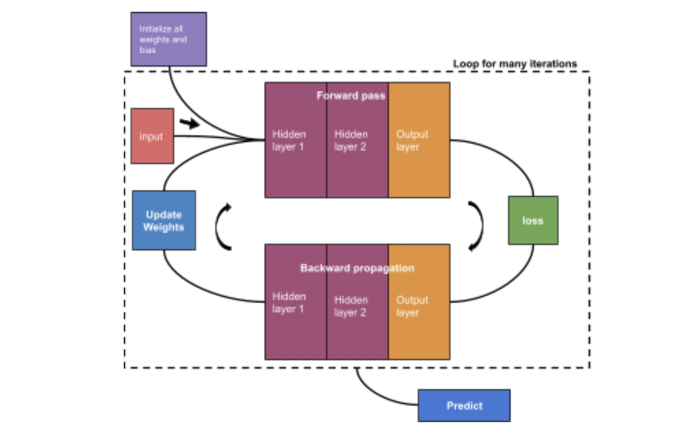

# CSCI-561-AI-Assignments

This repository contains programming assignments as part of the coursework for CSCI-561 Artificial Intelligence course taught by Prof. Laurent Itti.

## Homework-1: Shortest Feasible Path

### Brief Description:
Given safe locations for the rover, their coordinates, and paths, along with the rover's energy limit for uphill travel, the task is to determine the shortest feasible path from the starting point to the goal using three different implementations: Breadth-First Search (BFS), Uniform-Cost Search (UCS), and A* search algorithms.

### Algorithms Used:
- Breadth-First Search (BFS)
- Uniform-Cost Search (UCS)
- A* Search

## Homework-2: Duo Othello

### Brief Description:
To implement an AI agent to play the Duo Othello game on a 12x12 board configuration against another AI agent. The AI agent takes the board state as input and generates the optimal move to play for the given board state.

### Algorithms Used:
- Alpha-Beta Pruning
- Stability Evaluation Function

## Homework-3: Multi-Layer perceptron

To implement a multi-layer perceptron from scratch for a classification problem using the New York housing dataset. The network should train and predict for 10 different train-test splits outperforming the Grader's model under 5 minutes.

Feel free to explore each assignment's directory for more information.

